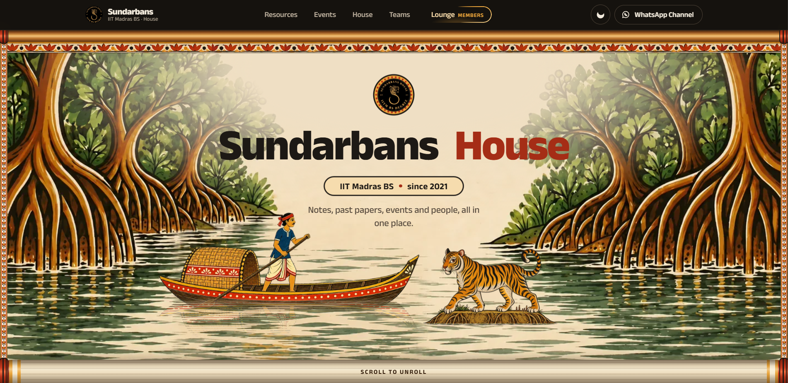
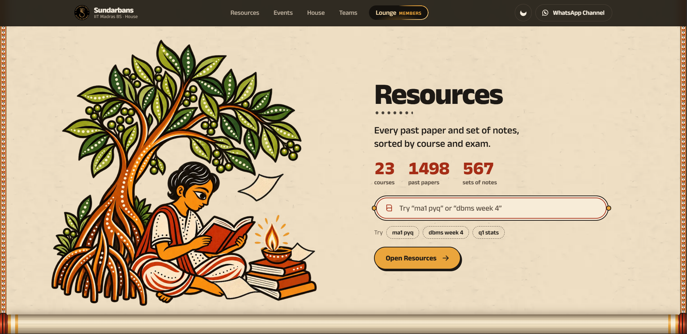
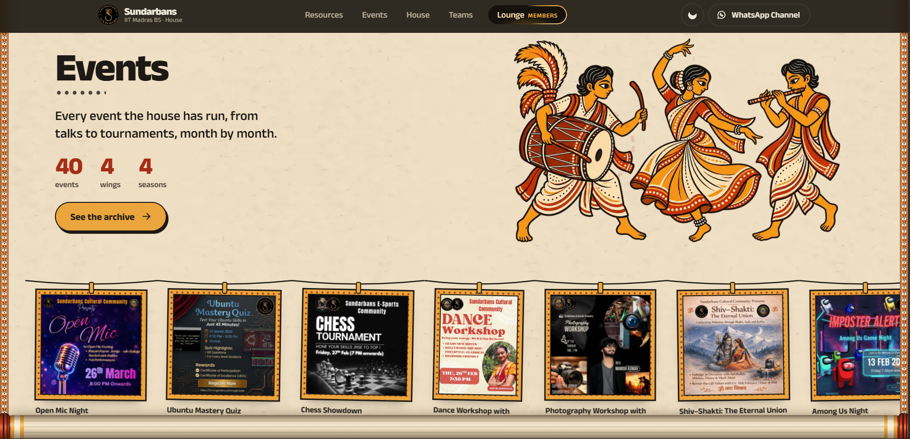
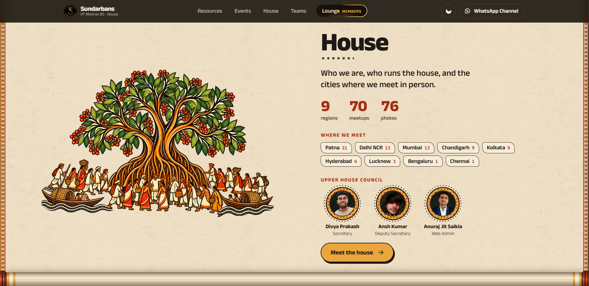

Sundarbans-House
A centralized platform for managing events, resources, team collaboration, and digital initiatives of Sundarbans House.










Structure

```
Sundarbans-House_Vue-main/
├── index.html                        # App entry HTML
├── vite.config.js                    # Vite build config
├── package.json                      # Dependencies and scripts
│
├── public/                           # Static assets (served as-is)
│   ├── assets/
│   │   ├── logo.png
│   │   └── frames/                   # Animation frames (001–240 JPEGs)
│   │                                 # Used for scroll-based video animation
│   └── data/
│       └── doubts.json               # Static FAQ/doubts data
│
├── readme-images/          # README screenshots (WebP + original PNGs)
│   ├── login.html / login.css / login.js
│   ├── dashboard.html / dashboard.css / dashboard.js / dashboard.json
│   ├── members.html / members.css / members.js / members.json
│   └── whatsapp.html
│
└── src/                              # Vue app source
    ├── main.js                       # App bootstrap (router, theme, tokens)
    ├── App.vue                       # Shell: nav, page, footer, course sheet, toast
    ├── router/
    │   └── index.js                  # All routes, old-URL redirects, scroll + page transitions
    ├── pages/                        # One *Page.vue per route (Home = Pat)
    ├── components/
    │   └── site/                     # Components used by the pages
    ├── lib/                          # Shared state and data adapters (store, events, house, courses, theme)
    ├── data/                         # Static data: events, council, teams, course data
    │   └── meetups/json/             # Per-region meetup data
    └── assets/
        ├── tokens.css                # Colours (light/dark), type, spacing
        └── pat/                      # Pat home artwork
```

